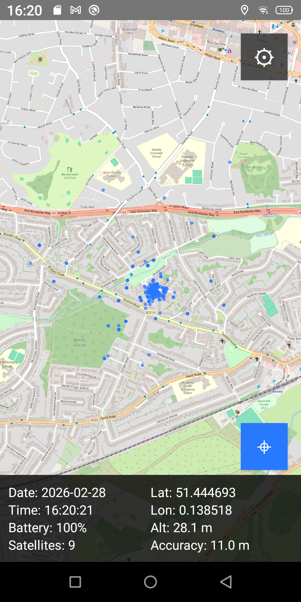
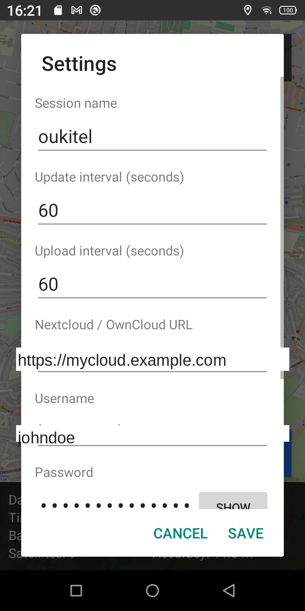
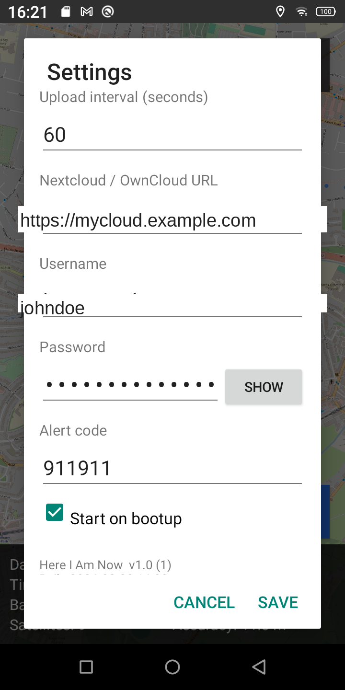

# Here I Am Now — User Guide

**Here I Am Now** is an Android GPS tracking app that records your location,
saves it to log files on the phone, and uploads them automatically to a
Nextcloud or OwnCloud server. It runs continuously in the background and can
alert you remotely by playing a sound, flashing the torch, vibrating the
phone, and taking photographs.

The app requires no Google Play Services and works on any Android phone
running Android 5.0 (API 21) or later, including de-Googled and custom ROM
devices.

---

## Contents

1. [Installation](#1-installation)
2. [Main Screen](#2-main-screen)
3. [Data Overlay](#3-data-overlay)
4. [Map Controls](#4-map-controls)
5. [Settings](#5-settings)
6. [Log Files](#6-log-files)
7. [Nextcloud Upload](#7-nextcloud-upload)
8. [Remote Alert System](#8-remote-alert-system)
9. [Background Operation](#9-background-operation)
10. [Start on Bootup](#10-start-on-bootup)

---

## 1. Installation

Install the APK file directly on the phone (sideload). You do not need the
Google Play Store.

1. On the phone go to **Settings → Security** and enable **Install unknown
   apps** (or **Unknown sources**) for your browser or file manager.
2. Download or copy `m21hereiamnow.apk` to the phone.
3. Open the APK file and tap **Install**.
4. When the app first opens, grant the **Location** and **Camera** permissions
   when prompted.

> On Android 11 and later the app uses the standard `Documents` folder
> without needing storage permission.

---

## 2. Main Screen



The full screen shows an **OpenStreetMap** map centred on your current
location. Two buttons are visible:

| Button | Position | Function |
|--------|----------|----------|
| ⚙ (grey) | Top-right | Opens the Settings dialog |
| ⊕ (blue) | Bottom-right | Re-centres the map on your current position |

Your **current location** is shown as a solid blue dot. A trail of smaller
blue dots shows previously recorded positions within the **Display period**
and with at least **Min satellites** in fix (see [Settings](#5-settings)).
An optional **track line** can be drawn connecting the dots in a colour of
your choice (see [Track colour](#track-colour) in Settings).

The notification bar at the top of the phone will show a persistent
**"Here I Am Now"** notification while the app is running, displaying your
current coordinates. This keeps the background service alive.

---

## 3. Data Overlay

A semi-transparent bar at the bottom of the screen shows live data.
The three columns are updated at each **Update interval**:

| Left column | Centre column | Right column (right-justified) |
|-------------|---------------|-------------------------------|
| `Dist: X.XX km` | Latitude | "What3Words" |
| `Speed: X.X km/h` | Longitude | word 1 |
| `Ascent: X m` | Altitude (m, integer) | word 2 |
| Satellites in fix | Accuracy (m, integer) | word 3 |

### Dist (distance)
Total distance in kilometres between consecutive GPS fixes recorded within
the current **Display period**. Calculated using the Haversine formula.
Resets when the service is restarted or when the display period rolls over.

### Speed
Average speed over the display period: **Dist ÷ Display period (hours)**,
shown in km/h. This is a session-average speed, not instantaneous speed.

### Ascent
Cumulative altitude climbed (metres) within the display period. Only upward
altitude changes of 5 m or more are counted, filtering out GPS altitude noise.
Descents are ignored.

> Battery percentage is **not** shown on screen but is still recorded in the
> log files at every GPS fix.

### What3Words
The three-word address for the most recently logged GPS fix, updated at each
**Update interval**. Shows `--` until the first fix is logged or while a
lookup is in progress.

When a What3Words address is shown the three words turn **light blue**.
Tapping anywhere on the What3Words column opens
`https://w3w.co/word1.word2.word3` in the default web browser.

---

## 4. Map Controls

| Gesture | Action |
|---------|--------|
| **Pinch in / out** | Zoom (levels 1–19) |
| **Single-finger drag** | Pan the map |
| **Tap ⊕ button** | Snap map back to current GPS position |

The blue location dot moves independently of the map centre — if you pan
away to look at another area, the dot continues to show your real position.
Tap ⊕ to return the view to your location.

Map tiles are fetched from **OpenStreetMap** over the internet and cached
while the app is running.

**Pinch zoom tile loading:** while your fingers are on the screen the
existing map tiles scale smoothly. New higher-resolution tiles are only
fetched after you lift your fingers, with an 800 ms pause before loading
begins. Zooming in defers the switch to higher-resolution tiles until you
have scaled to 4× the current tile size; zooming out switches back to
lower-resolution tiles promptly at 0.5×.

---

## 5. Settings

Tap the ⚙ button to open the Settings dialog. Scroll down to see all
options. Tap **Save** to apply changes immediately; tap **Cancel** to
discard. Tap **Help** at the top to open the built-in help page.




### Session name
A label used as the subfolder name when uploading to Nextcloud.
Default: `mobyphone`

Use a different name for each phone so their files are stored separately on
the server, e.g. `phone1`, `alice`, `car`.

### Update interval (seconds)
How often the app records a GPS fix and writes a row to the log files.
Default: `60` seconds. Minimum: `10` seconds.

### Upload interval (seconds)
How often the app uploads the log files to Nextcloud.
Default: `300` seconds (5 minutes). Minimum: `10` seconds.

The upload interval must be greater than or equal to the update interval.
If a smaller value is entered, it is automatically raised to match the
update interval when **Save** is tapped and a notification is shown.

### Nextcloud / OwnCloud URL
The base URL of your Nextcloud or OwnCloud server.
Example: `https://cloud.example.com`

### Username / Password
Your Nextcloud login credentials. Tap **Show** to reveal the password.

### Alert code
A numeric or text code used for the remote alert feature (see
[Section 8](#8-remote-alert-system)).
Default: `911911`

### Min satellites
The minimum number of GPS satellites required for a fix to be shown as a
small blue dot on the map. Fixes with fewer satellites than this value are
recorded in the log files but not displayed on the map trail.
Default: `4`

Set to `0` to display all recorded positions regardless of GPS quality.

### Display period (hours)
How far back in time the map trail of small blue dots extends.
Default: `12` hours.

This setting also defines the time window used to calculate **Dist**,
**Speed**, and **Ascent** in the data overlay. Changing this value and
tapping **Save** updates the map and all three figures immediately.

### Num GPS fixes
How many GPS samples to collect and average for each logged position.
Default: `5`

When set to more than 1, the app samples GPS every 5 seconds, collects
the requested number of fixes, removes statistical outliers, and logs
the averaged position. This improves accuracy compared to using a single
raw fix. Set to `1` to disable averaging and log each fix immediately.

The GPS receiver is automatically duty-cycled to save battery: it is
switched off after each log tick and restarted only shortly before the
next tick is due. With default settings (60 s interval, 5 fixes) the
GPS is active for approximately 30 s and off for 30 s, saving around
50 % of GPS battery consumption compared to running continuously.

### Track colour
Colour of the line drawn between the GPS track dots on the map.
Default: `None` (no line, dots only).

| Option | Effect |
|--------|--------|
| None | No line drawn; only the small blue dots are shown |
| Blue | Fine blue line connecting the dots |
| Red | Fine red line |
| Yellow | Fine yellow line |
| Black | Fine black line |

The line is drawn beneath the dots so the dots remain clearly visible.
The selected colour is saved and restored when the app restarts.

### Start on bootup
When ticked (default), the app starts automatically when the phone is
switched on. No manual launch is needed.

### Help
Tap the **Help** button at the top of the Settings dialog to open the
built-in help page. The page is titled **Here I Am Now for Nextcloud**
and covers a summary of the app, how it works, all settings, the remote
alert system, log file formats, and the in-app update feature. A
contact email link is shown at the bottom of the page.

### App updates
Each time the Settings dialog is opened, the app checks GitHub for a
newer release. The result is shown below the build information:

| Message | Meaning |
|---------|---------|
| `Checking for updates…` | Check in progress |
| `Up to date (v1.7)` | You have the latest version |
| `New version available: v1.x` | A newer release exists |

When a new version is available, a **Download & Install vX.Y** button
appears. Tap it to download the new APK in the background (a progress
notification is shown) and launch the system installer automatically
when the download is complete.

A permanent **Reinstall from GitHub** button is always shown below the
version check. Use this to re-download and reinstall the current
release APK at any time — for example to pick up minor fixes that have
been published to the release without a version number change.

---

## 6. Log Files

The app writes four log files per day, all stored in the phone's **Documents**
folder (`Internal Storage / Documents`):

| File | Format | Contents |
|------|--------|----------|
| `YYYY-MM-DD-hia.csv` | CSV | One row per GPS fix: timestamp, lat, lon, alt, accuracy, satellites, battery, What3Words link |
| `YYYY-MM-DD-hia.gpx` | GPX 1.1 | GPS track, suitable for mapping software and OSM GPS Traces |
| `YYYY-MM-DD-hia.kml` | KML 2.2 | GPS track with both a route line and individual waypoints |
| `YYYY-MM-DD-hia.txt` | Plain text | Debug and status log, including What3Words lookup results |

Files roll over at midnight. Files older than **30 days** are deleted
automatically.

### CSV format

```
timestamp,date,time,latitude,longitude,altitude_m,accuracy_m,satellites,battery_pct,what3words
2026-02-28 14:18:40,2026-02-28,14:18:40,51.444040,0.143970,-149.0,16.1,6,100,https://w3w.co/word1.word2.word3
```

The `what3words` column contains a clickable link in the format
`https://w3w.co/word1.word2.word3`. The cell is empty if the lookup failed
or has not yet completed for that fix.

### GPX format

Standard GPX 1.1 track file with `<trkpt>` elements containing latitude,
longitude, altitude, UTC timestamp, and satellite count. Compatible with
OsmAnd, GPSLogger, OpenStreetMap GPS Traces, and other mapping tools.

### KML format

Each GPS fix is written as both:
- An individual **`<Point>` placemark** named with the timestamp — imported
  as a waypoint/POI by apps such as Magic Earth.
- A **`<LineString>` track** connecting all fixes for the day — displayed as
  a route line in Google Earth and other KML viewers.

### What3Words in the TXT log

After each averaged GPS fix the app looks up the What3Words address for that
location and records the result in the debug log:

```
W3W: looking up 51.444040,0.143970
W3W: https://w3w.co/word1.word2.word3
```

If the lookup fails, the reason is logged and the app backs off automatically
before retrying:

```
W3W: HTTP 503 — backing off
W3W: will retry after 4 tick(s) (240s)
W3W: backing off (3 tick(s) remaining)
```

The backoff doubles after each consecutive failure (2 → 4 → 8 → 16 ticks,
capped at 16). It resets automatically on success or when **Save** is tapped
in Settings.

---

## 7. Nextcloud Upload

The app uploads today's four log files (`.csv`, `.gpx`, `.kml`, `.txt`) to
your Nextcloud server at every **upload interval**.

Files are stored at:
```
{Nextcloud URL}/remote.php/dav/files/{username}/hereiam/{session}/
```

For example, with session name `alice`:
```
https://cloud.example.com/remote.php/dav/files/myuser/hereiam/alice/
```

The `hereiam/` and session folders are created automatically if they do not
exist. Previous days' files are not re-uploaded.

Upload results are written to the `.txt` debug log, for example:

```
Upload starting: url=https://cloud.example.com user=myuser session=alice
MKCOL hereiam/: 405
MKCOL alice/: 405
PUT 2026-02-28-hia.csv (22497 bytes) → HTTP 204
PUT 2026-02-28-hia.gpx (39239 bytes) → HTTP 204
PUT 2026-02-28-hia.kml (10726 bytes) → HTTP 204
PUT 2026-02-28-hia.txt (60191 bytes) → HTTP 204
Upload done: 4 file(s) → alice
```

> HTTP 405 on MKCOL means the folder already exists — this is normal.
> HTTP 204 on PUT means the file was uploaded successfully.

---

## 8. Remote Alert System

You can trigger a full alert on the phone remotely by uploading an MP3 file
to Nextcloud. When triggered the phone plays an alarm, flashes the torch,
vibrates, and **takes photographs** from both cameras.

### How it works

1. Upload a file named `{alert code}.mp3` (e.g. `911911.mp3`) into the
   session folder on Nextcloud:
   ```
   hereiam/{session}/911911.mp3
   ```
2. At the next upload interval the phone detects the file and immediately:
   - **Takes a photograph** from the front camera.
   - **Takes a photograph** from the rear camera.
   - Uploads both JPEG images to the same Nextcloud session folder.
3. The phone then plays the MP3 **4 times** with 5-second pauses between
   plays. During each play:
   - The MP3 plays at **maximum alarm volume**, bypassing Do Not Disturb.
   - The **camera LED torch flashes** on and off.
   - The **phone vibrates** in sync with the flash.
4. A red **Cancel Alert** button appears at the top of the screen.
5. The alert repeats every upload cycle until **Cancel Alert** is tapped.

### Alert photographs

Two JPEG images are captured and uploaded automatically:

| File | Camera |
|------|--------|
| `YYYY-MM-DD-HHmmss-hia-alert-front.jpg` | Front (selfie) camera |
| `YYYY-MM-DD-HHmmss-hia-alert-rear.jpg` | Rear camera |

The photos are taken silently in the background so the alarm starts
without delay. They are uploaded to the same Nextcloud session folder as
the log files.

The **Camera** permission must be granted when the app first opens.

### Cancelling the alert

Tap **Cancel Alert** on the screen. This:
- Stops playback immediately.
- Turns off the torch and vibration.
- **Renames** `{alert code}.mp3` to `YYYY-MM-DD-{alert code}.mp3` on Nextcloud,
  keeping a timestamped record of the alert and preventing it from repeating.

The debug log records each step:

```
Alert: 911911.mp3 found, downloading
Alert: downloaded 9030 bytes
Alert photos: capturing front
Alert photo: saved 2026-03-01-112233-hia-alert-front.jpg (187432 bytes)
Alert photo: uploaded 2026-03-01-112233-hia-alert-front.jpg → HTTP 201
Alert photos: capturing rear
Alert photo: saved 2026-03-01-112233-hia-alert-rear.jpg (243891 bytes)
Alert photo: uploaded 2026-03-01-112233-hia-alert-rear.jpg → HTTP 201
Alert: playing 4 times
Alert: playing (1/4)
Alert: playing (2/4)
Alert: playing (3/4)
Alert: playing (4/4)
Alert: playback complete
Alert: cancelled by user
Alert: 911911.mp3 renamed to 2026-03-01-911911.mp3 on Nextcloud
```

---

## 9. Background Operation

The app runs as an Android **foreground service**. This means:

- It continues recording GPS and uploading files even when the screen is
  off or another app is in use.
- A persistent notification is shown in the notification bar. This is
  required by Android to keep background services running reliably.
- If the service is killed by the system (e.g. low memory), Android
  restarts it automatically (`START_STICKY`).
- As a foreground service it is exempt from Android Doze mode
  restrictions — GPS and network access continue to work normally even
  when the phone is stationary with the screen off.

### Battery efficiency

The app is designed to minimise battery use between log ticks:

- The CPU sleeps between Handler callbacks — there are no spin loops.
- **GPS duty cycling**: when **Num GPS fixes** is greater than 1, the
  GPS receiver is turned off after each log tick and restarted only
  when fixes are needed for the next tick. This significantly reduces
  GPS on-time (see [Num GPS fixes](#num-gps-fixes) for details).
- When **Num GPS fixes** is 1, the GPS is requested at the full update
  interval, so the chip duty-cycles itself at the OS level.
- Nextcloud uploads and What3Words lookups run on background threads
  and do not block the main service loop.

You can safely leave the app running continuously for days or weeks.

---

## 10. Start on Bootup

With **Start on bootup** ticked (default), the app starts automatically
when the phone is switched on or restarted. No manual launch is needed.

To disable this, open Settings, untick **Start on bootup**, and tap Save.

---

## Compatibility

- **Android version**: 5.0 (API 21) and later
- **Google Play Services**: not required
- **De-Googled / custom ROM**: fully compatible
- **Map tiles**: OpenStreetMap (internet connection required for tile loading)
- **Nextcloud / OwnCloud**: any self-hosted instance accessible over HTTPS

---

## Build information

The app version, build date, and update status are shown at the bottom
of the Settings dialog, for example:

```
Here I Am Now  v1.7 (8)
Built: 2026-04-01 17:21
Up to date (v1.7)
```

Source code and releases: https://github.com/harrowmd/m21hereiam
